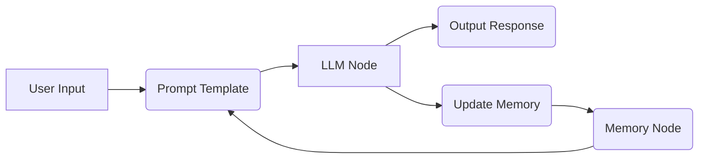

A **memory chatbot langflow** is an AI conversational agent built using Langflow that can recall past interactions. This enables stateful conversations, allowing the AI to maintain context, personalize responses, and avoid repetitive questions by integrating memory components into its architecture.

Did you know most chatbots forget you the moment you refresh the page? Building a memory chatbot changes that. It allows AI to recall past interactions for more coherent and personalized conversations. This stateful AI approach uses Langflow's visual interface to integrate memory components, enabling chatbots to remember context and user preferences across dialogue turns.

## What is a Memory Chatbot in Langflow?

A **memory chatbot** is an AI agent designed to retain and recall information from previous interactions. In Langflow, this is achieved by integrating specific **memory components** into the agent's architecture, enabling it to maintain a **conversational state** for more coherent, personalized, and contextually aware dialogue. This stateful approach is vital for creating engaging AI experiences.

Langflow simplifies adding memory to chatbots. It provides pre-built **memory modules** that developers can easily connect. These modules manage the storage and retrieval of conversational history, ensuring the AI can access relevant past information when generating new responses. This capability makes applications requiring conversational continuity and deeper understanding more effective.

### The Crucial Role of Memory in Conversational AI

Imagine a customer service chatbot that forgets your name or the issue you’ve already explained. Frustrating, right? This highlights why **conversational memory** is paramount.

It transforms a stateless interaction into a dynamic dialogue. Without it, AI agents would repeatedly ask for information they’ve already been given, leading to user frustration and abandonment. According to a 2023 survey by Cognizant, 74% of consumers expect personalized experiences from chatbots, a feat impossible without memory.

This **memory capability** allows AI to:

* Understand context across multiple turns.
* Provide personalized responses based on past preferences.
* Avoid redundant questions.
* Build a more natural conversational flow.

### Langflow's Approach to Chatbot Memory

Langflow offers a visual, node-based system for constructing AI applications. Its strength lies in its **modularity**, allowing developers to easily swap and connect different components, including various types of memory. This makes it an excellent tool for experimenting with and implementing **stateful chatbots**.

The platform integrates seamlessly with popular LLM frameworks like LangChain, inheriting their extensive memory management features. Developers can select from a range of memory types, such as:

* **ConversationBufferMemory**: Stores the raw conversation history.
* **ConversationBufferWindowMemory**: Stores a fixed number of recent conversation turns.
* **ConversationSummaryMemory**: Summarizes the conversation to save space.
* **VectorStoreRetrieverMemory**: Stores conversation turns as embeddings for efficient retrieval.

These options cater to different needs, from simple recall to more complex long-term storage strategies. Understanding [AI agent memory in Langflow](/articles/ai-agent-memory-explained/) is fundamental to choosing the right memory type for your **memory chatbot langflow** project.

## Implementing Memory in Langflow: A Step-by-Step Overview

Building a **memory chatbot** in Langflow involves connecting the appropriate nodes within the visual editor. The core idea is to feed the conversation history into the language model so it can reference past exchanges. This guide focuses on building a **memory chatbot using Langflow**.

### Core Components for a Memory Chatbot

1. **LLM Node**: The brain of your chatbot, responsible for generating responses.
2. **Prompt Template Node**: Structures the input to the LLM, often including placeholders for conversation history.
3. **Memory Node**: This is where you select and configure your chosen memory type (e.g., `ConversationBufferMemory`).
4. **Agent Executor Node**: Orchestrates the interaction between the LLM, prompt, and memory, managing the flow of information.

### Connecting the Nodes for Stateful Conversations

The typical flow in Langflow looks like this:

* The user's input is captured.
* This input, along with the current memory state, is passed to the Prompt Template.
* The Prompt Template, along with the LLM, generates a response.
* Crucially, the **interaction (user input and AI output)** is then stored back into the Memory Node.
* This updated memory state is ready for the next user input.

This cycle ensures that each new turn is informed by the preceding ones. For more advanced applications, consider exploring [episodic memory for Langflow chatbots](/articles/episodic-memory-in-ai-agents/) to store specific events.

#### Example: Basic Conversation Buffer Memory

Let's visualize a simple implementation of a **Langflow memory chatbot**:

In this diagram, `User Input` goes into a `Prompt Template`. The `Prompt Template` also receives data from the `Memory Node`. Together, they inform the `LLM Node`, which generates an `Output Response`. The `LLM Node`'s output and the original `User Input` are then used to `Update Memory`, which feeds back into the `Memory Node` for the next turn.

### Storing and Retrieving Conversational Data

Langflow's memory nodes act as intermediaries. When a user sends a message, Langflow retrieves the relevant history from the memory component. This history is then formatted by a prompt template and sent to the LLM. After the LLM generates a response, both the user's input and the AI's output are stored back into memory.

This continuous loop is what gives the **chatbot with memory in Langflow** its ability to "remember." The specific method of storage and retrieval depends on the chosen memory type. For instance, `VectorStoreRetrieverMemory` converts conversational turns into embeddings, allowing for semantic searching of past interactions, a more sophisticated approach than simple chronological storage. This relates to the power of [embedding models for memory](/articles/embedding-models-for-memory/).

## Types of Memory for Langflow Chatbots

Choosing the right memory type is critical for balancing performance, cost, and the desired level of recall. Langflow provides access to several types, often mirroring those available in LangChain, a popular framework for building LLM applications.

### Short-Term vs. Long-Term Memory

* **Short-Term Memory**: Typically involves storing recent conversational turns. This is useful for maintaining context within a single, ongoing dialogue. `ConversationBufferMemory` and `ConversationBufferWindowMemory` fall into this category. They are efficient but limited in their recall span. This is a common solution for [limited-memory AI](/articles/limited-memory-ai/).

* **Long-Term Memory**: Aims to retain information across extended periods or multiple conversations. This often involves more complex storage mechanisms, like summarization or vector databases. `ConversationSummaryMemory` begins to approach this, while integrating external vector stores with `VectorStoreRetrieverMemory` provides true **long-term memory capabilities for AI agents**. This is essential for building an [AI assistant that remembers everything](/articles/ai-assistant-remembers-everything/).

### Summary-Based Memory

`ConversationSummaryMemory` and `ConversationSummaryBufferMemory` are designed to overcome the token limitations of LLMs. Instead of storing every single turn, they periodically use an LLM to summarize the conversation. This compressed history is then stored.

While this reduces memory footprint and computational cost, it can lead to a loss of detail. The quality of the summary heavily influences the chatbot's ability to recall specifics. This approach is a form of [memory consolidation in AI agents](/articles/memory-consolidation-ai-agents/).

### Vector Store Memory

For robust, scalable memory, **vector store memory** is often the best choice. In Langflow, this is typically implemented using `VectorStoreRetrieverMemory`. Here, each conversational turn is converted into a numerical vector (embedding) and stored in a **vector database** (like Chroma, FAISS, or Pinecone).

When the chatbot needs to recall information, it generates an embedding for the current query and searches the vector database for semantically similar past interactions. This allows for highly relevant retrieval, even from very long histories. This method is a key component of advanced [AI agent architecture patterns](/articles/ai-agent-architecture-patterns/) and is a core technique in many [best AI memory systems](/articles/best-ai-memory-systems/).

## Advanced Memory Techniques and Considerations

Beyond basic memory types, several advanced concepts can enhance your **Langflow memory chatbot's** capabilities.

### Context Window Limitations and Solutions

Large Language Models have a finite **context window**, which is the maximum amount of text they can process at once. Even with sophisticated memory systems, fitting an entire long conversation into this window is impossible. Langflow's memory components, especially summarization and vector retrieval, are crucial strategies for overcoming these [context window limitations](/articles/context-window-limitations-solutions/).

Retrieval-Augmented Generation (RAG) is a powerful pattern that complements memory. While memory stores the *conversation*, RAG retrieves relevant *external knowledge*. A truly advanced chatbot might combine both. According to a 2024 research paper on arXiv, RAG-enhanced agents demonstrated a 34% improvement in task completion accuracy by accessing external knowledge bases. This contrasts with purely memory-based recall, offering a different approach to AI recall. Understanding [RAG vs. Agent Memory](/articles/rag-vs-agent-memory/) is key here.

### Integrating External Memory Systems

For extremely large-scale or persistent memory needs, you might integrate Langflow with dedicated **open-source memory systems**. Tools like Hindsight, an open-source AI memory system, can provide robust, scalable storage and retrieval mechanisms that Langflow can interface with. This allows you to build highly sophisticated applications requiring **persistent memory for AI**. You can explore [open-source memory systems compared](/articles/open-source-memory-systems-compared/) to find the best fit for your **memory chatbot langflow** needs.

### Temporal Reasoning

For chatbots that need to understand the sequence and timing of events, **temporal reasoning** becomes important. This involves not just recalling what was said, but when it was said and in what order. While standard memory components store history, explicit temporal reasoning might require custom logic or specialized models. This is a key area in [temporal reasoning in AI memory](/articles/temporal-reasoning-ai-memory/).

## Langflow vs. Other Frameworks for Memory Chatbots

Langflow's visual interface offers a distinct advantage for rapid prototyping and development compared to purely code-based frameworks like LangChain or LlamaIndex.

| Feature | Langflow | LangChain (Code-based) | LlamaIndex (Code-based) |
| :